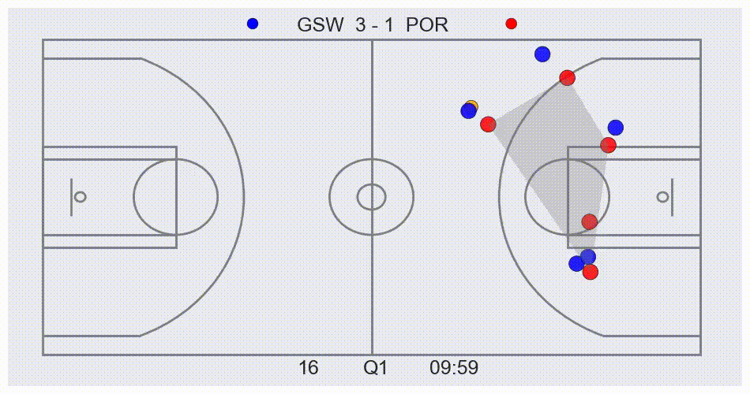
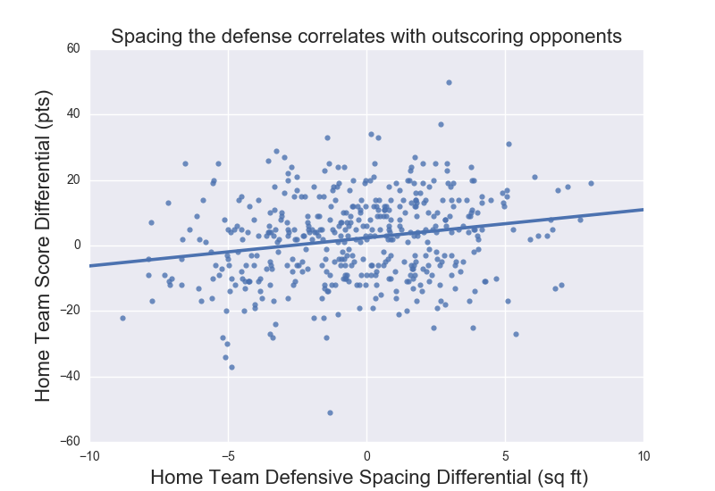
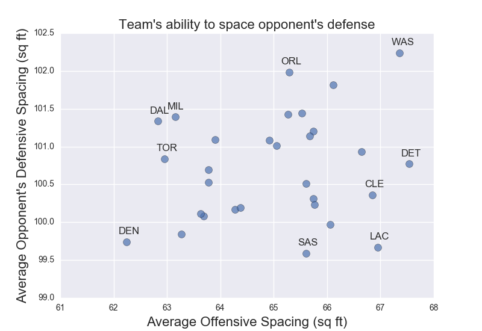

# NBA player tracking visualization and analysis

This library contains useful methods for visualizing and analyzing NBA player tracking data.

The data is located here and contains all player and ball locations for NBA games from the 2015-16 season.  Play-by-play data is obtained from nba.stats.com.

## Visualization
To visualize games from the tracking data, the `game` class in `game.py` is used.
```python
from Game import game
game = Game('01.08.2016', 'POR', 'GSW')
game.watch_play(game_time=6, length=120, commentary=False)
```


To easily follow the flow of the game, commentary can be added.
```python
game.watch_play(game_time=6, length=120, commentary=True)
```


If you are interested in a single player, they can easily be tracked.
```python
game.watch_play(game_time=2007, length=10, highlight_player='Stephen Curry', commentary=False)
```


All of a players actions can be extracted and viewed with a single method call.  Currently, actions can be in ['all_FG', 'made_FG', 'miss_FG', 'rebound'], but this method can be easily extended to include any action.

```python
game.watch_player_actions("Stephen Curry", "made_FG")
"""
This method will output a video for each of Steph's made FGs in the game, 
however, I am just diplaying one of them.
"""
```


## Analysis (In Progress)

Here, we analyze two aspects of basketball that are difficult to address without player tracking data:
* Defensive Spacing
* Player/Team Velocity

### Defensive Spacing

NBA commentators often praise offensive teams who can "Space the defense".  Essentially, if an offensive team can draw out defenders to the three point line, passing lanes will open up and drives to the basket will be less clogged and more efficient.  Here we analyze how effectively teams can space the defense.  

The workhorse of this analysis is `scipy.spatial.ConvexHull` which measures the convex hull of the defense (larger convex hull = more spaced defense).  This can be visualized:

```python
game.watch_play(121, 10, commentary=False, show_spacing='home')
```



`spacing_analysis.py` contains the code for the following analysis.  To process the data, only "set plays" were analyzed.  Since "transition plays" have unique spacing properties, we limited this analysis to "standard" plays where the offense and defense are set.

Which teams are best at spacing the defense? (Remember, spacing the defense more is thought to be better).  If we average over all time points for each team, we get the following:


Interestingly, we see that Detroit is the best team at spacing defenses.  [This is something that has been anecdotally documented by Mike Prada, and the data back up his claims.](http://www.sbnation.com/nba/2015/1/9/7517125/detroit-pistons-winning-streak-josh-smith-released)  Additionally, teams like Cleveland that are thought to have a modern offense, are great at spacing the defense.  

But the question is: **Does spacing the defense help you win?**  Here we look at the score differential vs defensive spacing and we see a positive correlation.  In fact, spacing the defense an extra 5 square feet correlates with increasing the score differential 4.25 points! 



If you stare at this graph long enough, you can notice it also shows the level of home court advantage in the NBA.  If you are interested, you can read an analysis of home court advantage I did [here.](https://github.com/christopherjenness/my-pdfs/blob/master/NBAHomeTeamAdvantage.pdf)

**How can a team space the defense better?**  Intuitively, spacing your offense will draw out the defense.  The plot below looks at each game, and plots how spaced the offenses and defenses were.  Clearly, a more spaced offense correlates with a more spaced defense.


But when you break it down by team, how effectively can each team space the defense?  Below is a plot of each teams average offensive spacing plotted against how well they can space the opponent's defense.  As expected, if a team has a well spaced offense, their opponents defense is more spaced.  There are a few interested exceptions though.



Notice Toronto (TOR).  Toronto has a hard time spacing the defense even though they space out their offense.  This is likely due to their star DeMar DeRozan being a shooting liability.  Defenders don't need to guard him out on the 3PT line, so they can keep the paint clogged.

Notice San Antonio (SAS).  San Antonio can effectively space the defense without spacing out their offense.  This may be due to having one of the best 3PT shooters in the league, Kawhi Leonard, who needs be guarded religiously at the 3PT line.

Currently, I'm working on breaking down defensive spacing per play to see the effect on individual plays instead of aggregated game data.  This is yielding interesting insights.

### Player Velocity

Player tracking data provides insight into tean's and player's velocity.  Here we analyze how player speed affects the flow of the game.  The analysis code can be found in `velocity_analysis.py`.

Using the visualization shwon above, team velocities can be shown as the game progresses:

```python
game = Game('01.08.2016', 'POR', 'GSW')
watch_play_velocities(game, game_time=7, length=54)
```


Alternatively, individual player velocities can be visualized:

```python
game = Game('01.08.2016', 'POR', 'GSW')
watch_play_velocities(game, game_time=7, length=54, highlight_player='Stephen Curry')
```


